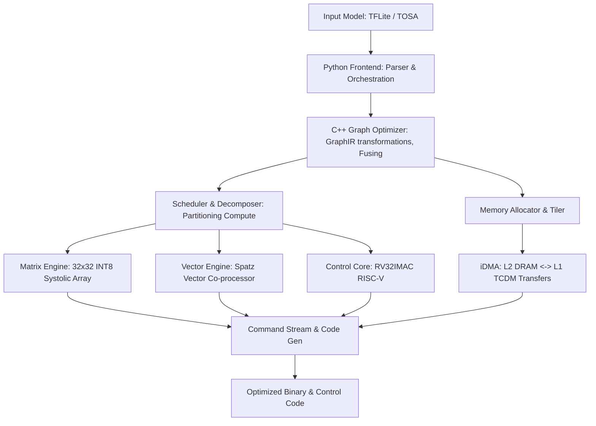

# Neural-AI Compiler

This repository contains the **Neural-AI Compiler** (`neural-compiler`), a specialized model compiler designed for the **Neural-AI NPU Cluster**. It is built using the architectural ideas, compilation pipeline, and codebase structure of **Arm Vela**.

The compiler converts neural networks defined in standard formats—specifically **TOSA** and **TensorFlow Lite (TFLite)**—into optimized binaries, memory tiling plans, and instruction streams tailored to the Neural-AI NPU Cluster.

---

## Architectural Mapping: From Vela to Neural-AI

The compiler adapts Vela's hybrid architecture (Python-based frontend and performance/optimisation-heavy C++ backend) to compile models for the heterogeneous engines of the Neural-AI NPU:



### 1. Frontend & Graph Optimization
* **Frontend:** Parses input models (TOSA/TFLite) using FlatBuffers, building an in-memory Graph IR representation.
* **Graph Optimizer:** Performs graph-level optimizations, constant folding, and operator fusing (e.g., fusing convolutions with activation functions).

### 2. Operation Scheduling & Decomposition
The compiler partitions and schedules operators onto the specific hardware engines of the Neural-AI NPU:
* **Matrix Engine:** Dense Matrix Multiplications and Convolutions are scheduled on the 32x32 INT8 Systolic Array.
* **Vector Engine:** Activation functions (SiLU, GELU, Softmax, Sigmoid) and element-wise operations are mapped to the Spatz Vector Engine.
* **Control Core:** Orchestration, tiling loops, and sequence synchronization logic run on the RV32IMAC control core.

### 3. Memory Allocation & DMA Tiling
Instead of generic SRAM/DRAM mapping, the compiler designs data-movement schedules matching the Neural-AI cluster memory hierarchy:
* **L1 TCDM (Tightly-Coupled Data Memory):** The compiler allocates local tensor buffers in the zero-starvation L1 SRAM banks.
* **iDMA Orchestration:** Background data transfer commands (via the modular iDMA engine) are generated to double-buffer and prefetch weights and activations between the global L2 (DRAM) and L1 TCDM.

---

## Key Components

The codebase preserves the hybrid development structure of Vela:
* **Frontend (`ethosu/vela/`)**: Python-based CLI handling arguments, configuration parsing, graph validation, and high-level orchestration.
* **Backend (`ethosu/regor/`)**: C++ implementation handling core optimization, operation scheduling, memory allocation, and final binary generation.

---

## Installation & Development

### Install Requirements
Make sure you have a C++17 capable compiler, CMake, and Python development headers installed on your system.

```bash
# Build the C++ backend and install python package in developer mode
CMAKE_ARGS="-DCMAKE_BUILD_TYPE=Debug" CMAKE_BUILD_PARALLEL_LEVEL=10 pip3 install -e ".[dev]"
```

### Run Compiler Tests
```bash
# Run unit tests
cmake -S ethosu/regor -B build-unit-tests -DCMAKE_BUILD_TYPE=Debug
cmake --build build-unit-tests -t check
```

---

## References & Documentation
* [Vela Original README](docs/vela/README.vela.md)
* **Neural-AI NPU Cluster Architecture** (refer to sibling `neural-ai` workspace repository)
* [CLI Options & Setup](docs/vela/OPTIONS.md)
* [Supported Operators](docs/vela/SUPPORTED_OPS.md)
